# GKE Architecture Diagram (Mermaid)

## System Architecture Overview

```mermaid
graph TB
    %% External User
    User[👤 Developer] --> Frontend
    
    %% Frontend Layer
    Frontend[Frontend Service<br/>Streamlit/React<br/>HPA: 2-5 pods] --> API
    
    %% API Layer
    API[API Gateway Service<br/>FastAPI + Auth<br/>HPA: 3-8 pods] --> LB
    
    %% Load Balancer
    LB[Load Balancer<br/>GKE Ingress Controller<br/>SSL Termination] --> Orchestrator
    
    %% Orchestrator
    Orchestrator[Orchestrator Service<br/>Ghostbusters Core<br/>StatefulSet: 1-3 replicas]
    
    %% AI Agent Services
    Orchestrator --> Security[Security Agent<br/>Vulnerability Scanning<br/>HPA: 3-10 pods<br/>256Mi-512Mi RAM]
    Orchestrator --> Quality[Quality Agent<br/>Code Quality Analysis<br/>HPA: 3-10 pods<br/>256Mi-512Mi RAM]
    Orchestrator --> Test[Test Agent<br/>Test Coverage Analysis<br/>HPA: 3-10 pods<br/>256Mi-512Mi RAM]
    Orchestrator --> Perf[Performance Agent<br/>Performance Analysis<br/>HPA: 3-10 pods<br/>256Mi-512Mi RAM]
    
    %% Storage
    Security --> Storage[Cloud Storage<br/>Code Repository<br/>Analysis Results<br/>Persistent Data]
    Quality --> Storage
    Test --> Storage
    Perf --> Storage
    
    %% Monitoring & Observability
    Storage --> Monitoring[Cloud Monitoring<br/>GKE Metrics<br/>Performance Data<br/>Auto-scaling Triggers]
    Storage --> Logging[Cloud Logging<br/>Centralized Logs<br/>Audit Trail<br/>Error Tracking]
    
    %% Quality Dashboard
    Monitoring --> Dashboard[Quality Dashboard<br/>Results Visualization<br/>Quality Gates<br/>Deployment Control]
    Logging --> Dashboard
    
    %% Production Environment
    Dashboard --> Production[Production Environment<br/>GKE Deployment<br/>Quality Gate Control<br/>Rollback Capability]
    
    %% GKE Cluster Container
    subgraph GKE["Google Kubernetes Engine (GKE) Cluster"]
        Frontend
        API
        LB
        Orchestrator
        Security
        Quality
        Test
        Perf
        Storage
        Monitoring
        Logging
        Dashboard
        Production
    end
    
    %% Styling
    classDef userClass fill:#e8f0fe,stroke:#1a73e8,stroke-width:2px
    classDef serviceClass fill:#f8f9fa,stroke:#34a853,stroke-width:2px
    classDef agentClass fill:#fef7e0,stroke:#f4b400,stroke-width:2px
    classDef storageClass fill:#fce8e6,stroke:#ea4335,stroke-width:2px
    classDef gatewayClass fill:#e6f4ea,stroke:#34a853,stroke-width:2px
    classDef gkeClass fill:#e8f0fe,stroke:#1a73e8,stroke-width:3px
    
    class User userClass
    class Frontend,API,Orchestrator,Monitoring,Logging,Dashboard,Production serviceClass
    class Security,Quality,Test,Perf agentClass
    class Storage storageClass
    class LB gatewayClass
    class GKE gkeClass
```

## GKE Features & Capabilities

### Auto-scaling
- **Horizontal Pod Autoscaler (HPA)** for all services
- **CPU-based scaling**: Scale up at 70%, down at 30%
- **Memory-based scaling**: Scale up at 80%, down at 40%
- **Custom metrics**: Scale based on AI workload demand

### Security
- **Network policies**: Pod-to-pod communication control
- **Pod security standards**: Restricted security context
- **Workload identity**: Service-to-service authentication
- **Encryption**: Data at rest and in transit

### Monitoring
- **Cloud Monitoring**: Built-in GKE metrics
- **Cloud Logging**: Centralized log aggregation
- **Custom metrics**: Application-specific performance data
- **Alerting**: Proactive issue detection

### Networking
- **Service discovery**: Automatic service registration
- **Load balancing**: Intelligent traffic distribution
- **Ingress controller**: External access management
- **SSL termination**: Secure HTTPS handling

## Performance Metrics

- **Response Time**: <500ms for analysis
- **Throughput**: 1000+ requests/second
- **Scalability**: 3-10 pods per service
- **Availability**: 99.9% uptime target
- **Quality Gates**: Security ≥80%, Quality ≥75%, Tests ≥70%
