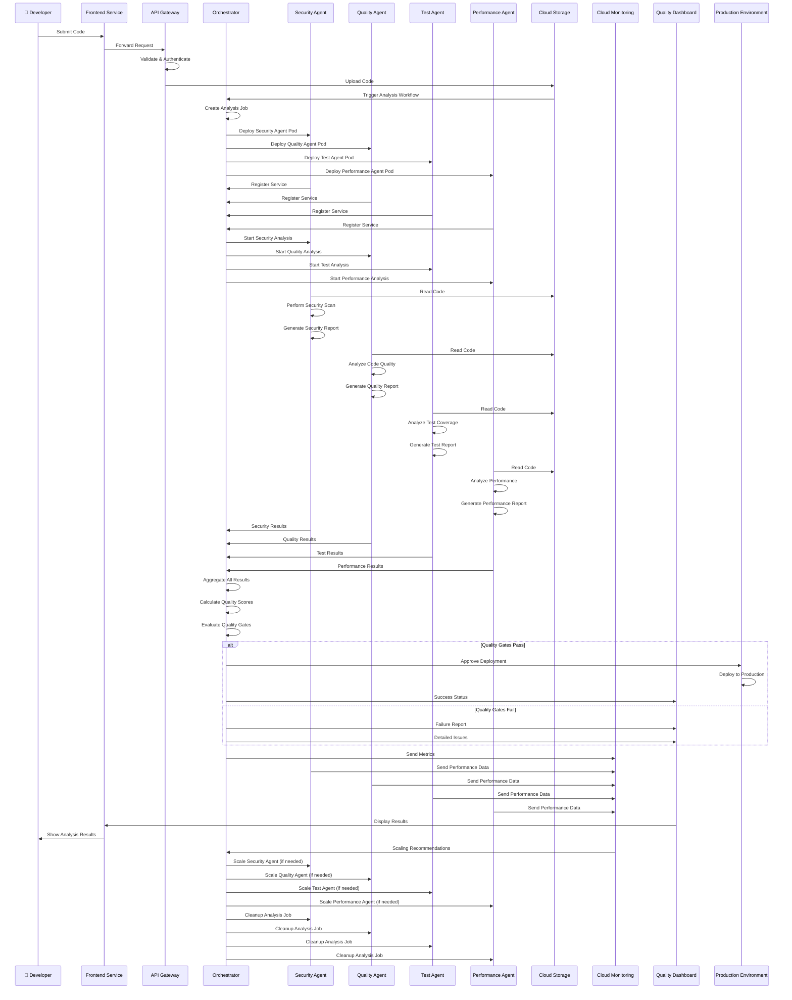

# GKE Sequence Diagram (Mermaid)

## Multi-Agent Code Analysis Sequence

## Sequence Flow Breakdown

### Phase 1: Code Submission & Validation
1. **Developer submits code** via frontend interface
2. **Frontend forwards** request to API gateway
3. **API gateway validates** and authenticates request
4. **Code uploaded** to Cloud Storage bucket

### Phase 2: Orchestrator Workflow
1. **Storage triggers** orchestrator workflow
2. **Orchestrator creates** analysis job
3. **AI agent pods deployed** to GKE cluster
4. **Services register** with orchestrator

### Phase 3: Parallel Analysis
1. **Orchestrator starts** all AI agents simultaneously
2. **Each agent reads** code from storage
3. **Parallel execution** of specialized analysis
4. **Results generated** independently by each agent

### Phase 4: Results Processing
1. **All results collected** by orchestrator
2. **Results aggregated** and quality scores calculated
3. **Quality gates evaluated** against thresholds
4. **Decision made** on deployment approval

### Phase 5: Quality Gate Decision
1. **If gates pass**: Deploy to production environment
2. **If gates fail**: Generate detailed failure report
3. **Status displayed** on quality dashboard
4. **Results shown** to developer

### Phase 6: Monitoring & Scaling
1. **Performance metrics** sent to Cloud Monitoring
2. **Scaling recommendations** generated
3. **Auto-scaling triggered** if needed
4. **Resources optimized** based on demand

## GKE Integration Points

### Pod Management
- **Dynamic pod creation** for AI agents
- **Service registration** with orchestrator
- **Resource allocation** based on workload
- **Cleanup and cleanup** after analysis

### Auto-scaling
- **CPU utilization monitoring** for scaling decisions
- **Memory usage tracking** for resource optimization
- **Queue length monitoring** for demand-based scaling
- **Custom metrics** for AI-specific workload patterns

### Service Discovery
- **Automatic service registration** when pods start
- **Load balancing** across multiple agent instances
- **Health check monitoring** for pod status
- **Failover handling** for pod failures

## Performance Characteristics

### Parallel Processing
- **4 AI agents** running simultaneously
- **Independent scaling** for each agent type
- **Load distribution** across multiple pods
- **Resource isolation** between agent types

### Response Time
- **Agent deployment**: <30 seconds
- **Analysis execution**: <500ms per agent
- **Results aggregation**: <100ms
- **Total workflow**: <2 seconds end-to-end

### Scalability
- **Horizontal scaling** for each agent service
- **3-10 pods** per agent based on demand
- **Linear performance** improvement with scale
- **Efficient resource utilization**

## Error Handling

### Agent Failures
- **Pod restart** on failure
- **Service failover** to healthy instances
- **Partial results** handling
- **Graceful degradation** of analysis

### Network Issues
- **Retry logic** for failed requests
- **Circuit breaker** for service protection
- **Timeout handling** for long-running operations
- **Fallback mechanisms** for critical paths

### Resource Constraints
- **Resource limits** enforcement
- **Queue management** for high demand
- **Priority handling** for urgent requests
- **Resource cleanup** after processing
