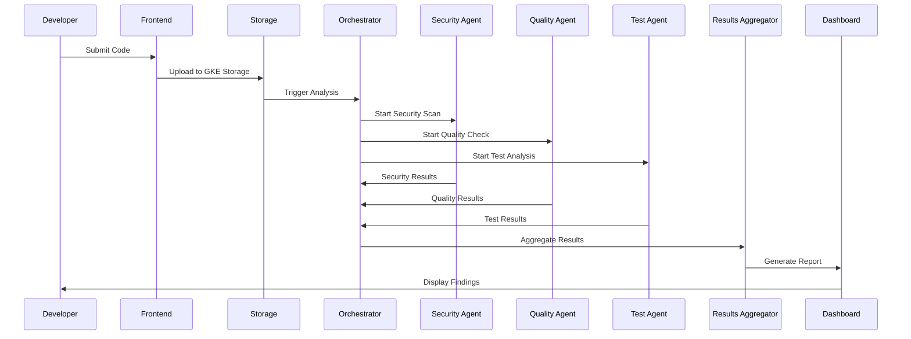
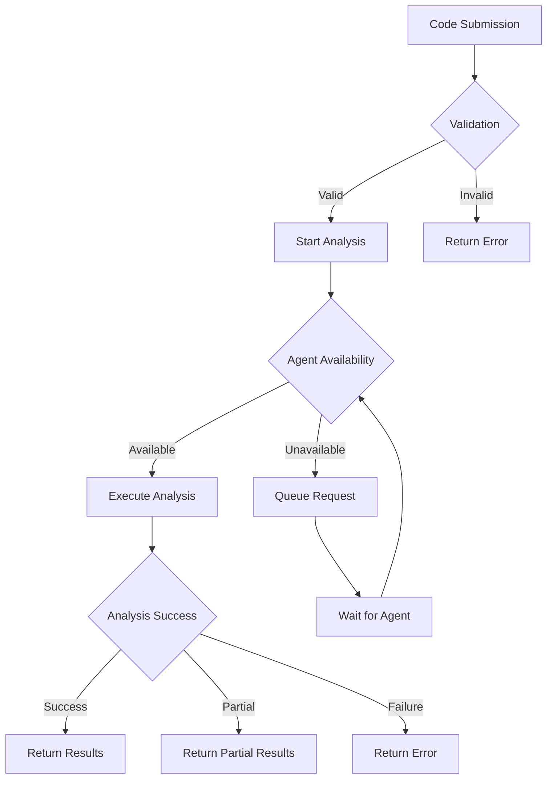
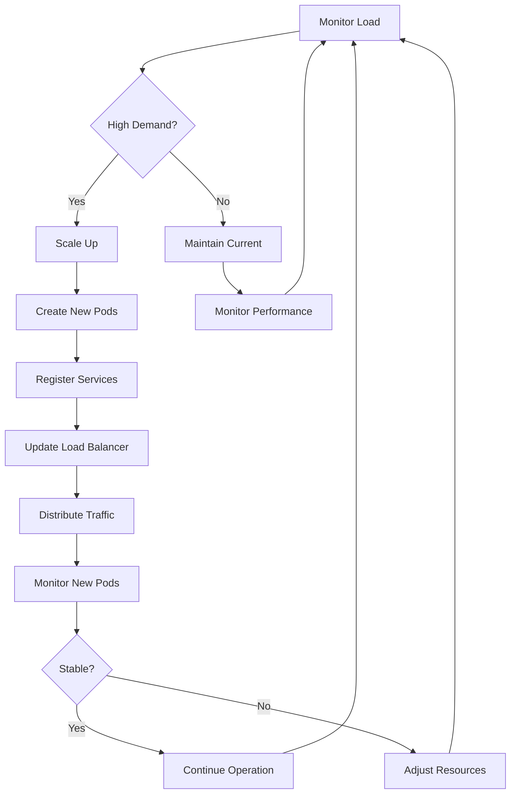
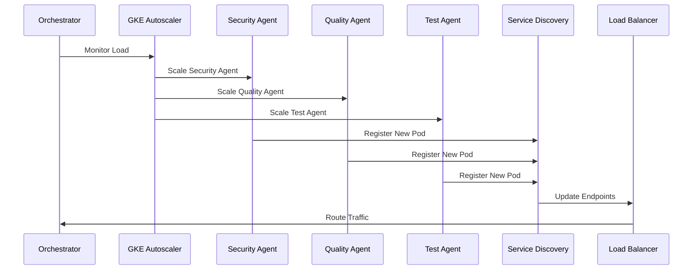
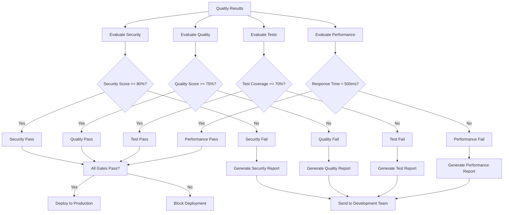
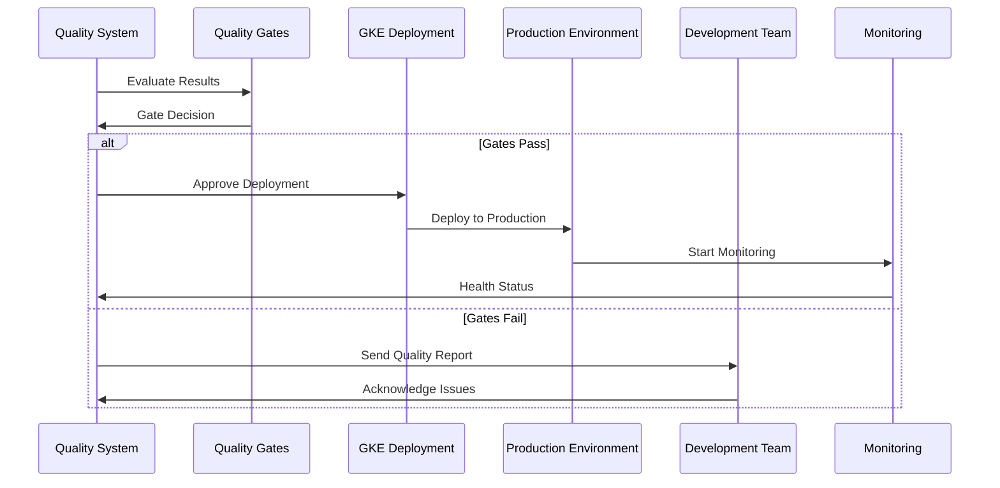
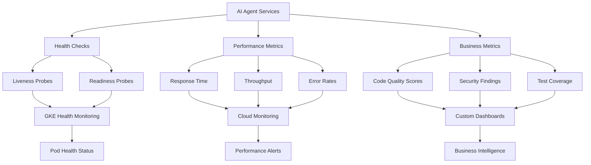
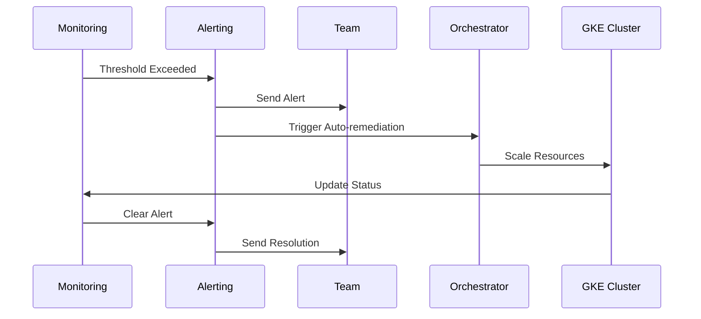
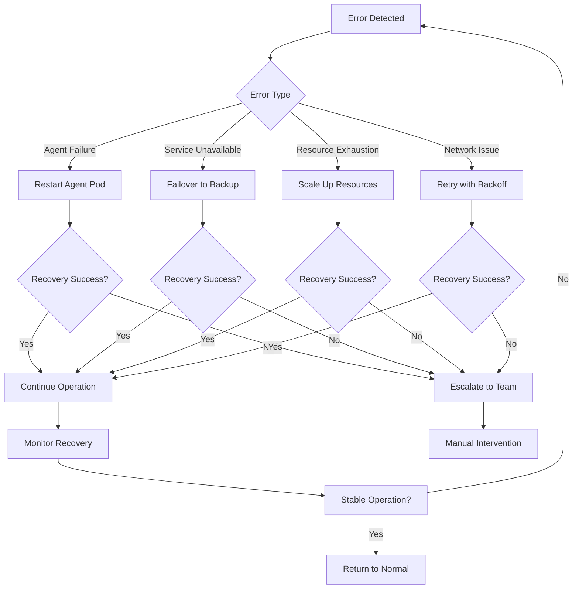
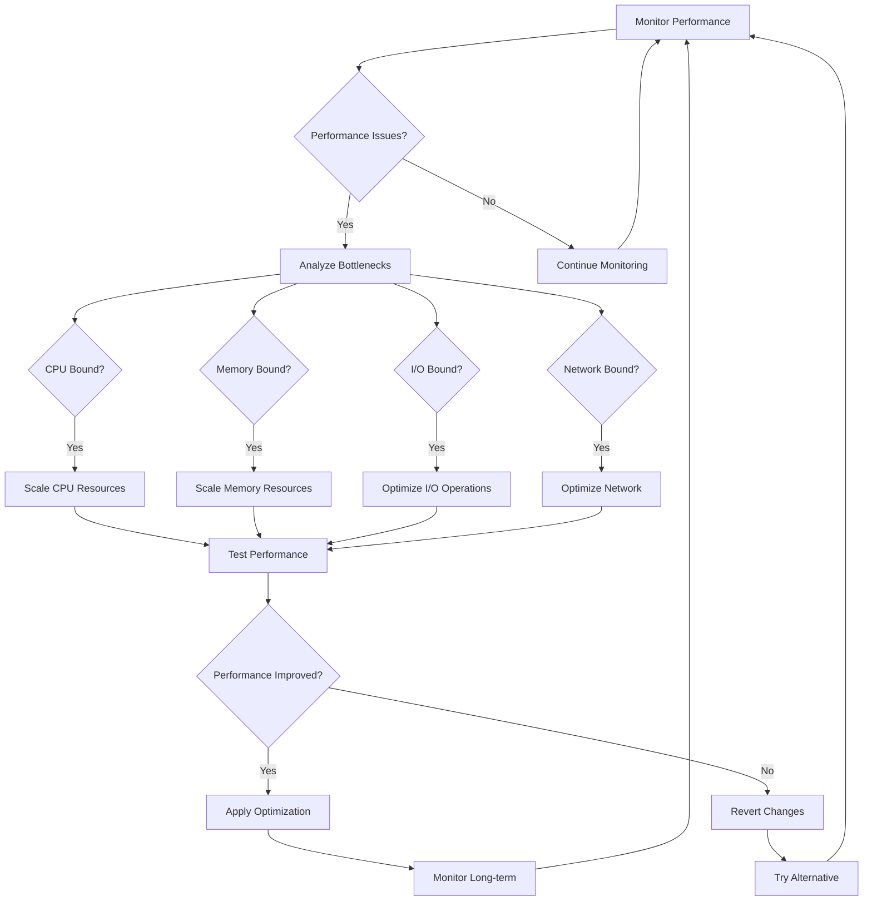

# GKE Hackathon Use Case Diagrams

**Project:** Ghostbusters AI Agent Microservices Platform on GKE  
**Purpose:** Visual representation of use cases for Google review  
**Format:** Mermaid diagrams for easy viewing and modification  

---

## 🎯 Use Case 1: Multi-Agent Code Analysis Workflow

### **Primary Flow:**

### **Alternative Flows:**

---

## 🎯 Use Case 2: AI Agent Orchestration and Scaling

### **Scaling Workflow:**

### **Service Discovery:**

---

## 🎯 Use Case 3: Quality Gate Enforcement

### **Quality Decision Flow:**

### **Deployment Workflow:**

---

## 🎯 Use Case 4: Real-Time Monitoring and Observability

### **Monitoring Architecture:**

### **Alerting Flow:**

---

## 🎯 Use Case 5: Error Handling and Recovery

### **Error Recovery Flow:**

---

## 🎯 Use Case 6: Performance Optimization

### **Performance Tuning Flow:**

---

## 📊 Use Case Summary Matrix

| Use Case | Primary Actors | GKE Features Used | Business Value |
|----------|----------------|-------------------|----------------|
| **Multi-Agent Analysis** | Developer, AI Agents, Orchestrator | Pod Autoscaling, Service Discovery | Automated code review |
| **Agent Orchestration** | Orchestrator, GKE Autoscaler | HPA, Load Balancing | Intelligent scaling |
| **Quality Gates** | Quality System, GKE Deployment | Deployment Control, Monitoring | Quality enforcement |
| **Real-time Monitoring** | Monitoring, Alerting, Team | Cloud Monitoring, Health Checks | Proactive operations |
| **Error Recovery** | Error Detection, Recovery System | Pod Restart, Failover | High availability |
| **Performance Tuning** | Performance Monitor, Optimization | Resource Scaling, Metrics | Optimal performance |

---

## 🔗 Integration with GKE Features

### **GKE Features Demonstrated:**
- ✅ **Horizontal Pod Autoscaler** - Dynamic scaling based on demand
- ✅ **Service Discovery** - Automatic service registration and discovery
- ✅ **Health Checks** - Liveness and readiness probes
- ✅ **Load Balancing** - Intelligent traffic distribution
- ✅ **Resource Management** - CPU and memory limits and requests
- ✅ **Monitoring** - Cloud Monitoring integration
- ✅ **Security** - Network policies and pod security standards
- ✅ **Deployment** - Rolling updates and rollback capabilities

---

**These use case diagrams provide a comprehensive view of how our Ghostbusters AI Agent Microservices Platform will operate on GKE, demonstrating real-world value while showcasing GKE's capabilities.**

**Ready for Google's review and guidance!** 🚀
