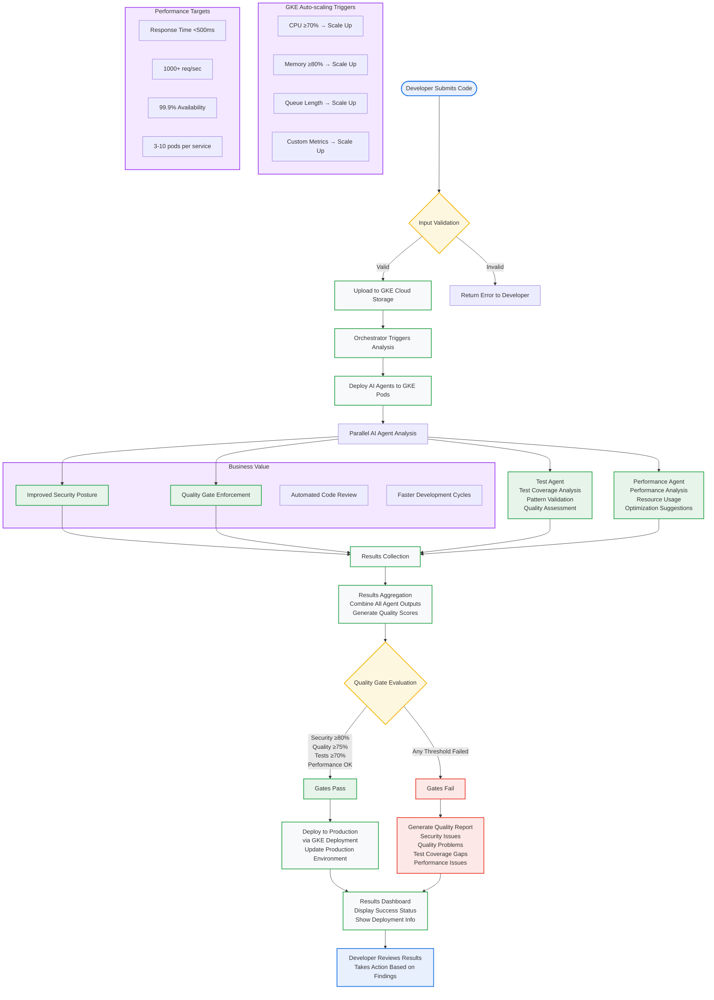

# GKE Workflow Diagram (Mermaid)

## Intelligent Code Review Pipeline Workflow

## Workflow Steps Breakdown

### 1. Code Submission & Validation
- **Developer submits code** via web interface
- **Input validation** and sanitization
- **Error handling** for invalid submissions

### 2. GKE Storage & Orchestration
- **Upload to Cloud Storage** bucket
- **Orchestrator triggers** multi-agent analysis
- **GKE pod deployment** for AI agents

### 3. Parallel AI Analysis
- **Security Agent**: Vulnerability scanning, security analysis
- **Quality Agent**: Code style, complexity, maintainability
- **Test Agent**: Coverage analysis, pattern validation
- **Performance Agent**: Performance analysis, optimization

### 4. Results Processing
- **Results collection** from all agents
- **Aggregation** and quality scoring
- **Quality gate evaluation** against thresholds

### 5. Quality Gate Decision
- **Pass**: Deploy to production via GKE
- **Fail**: Generate detailed quality report
- **Thresholds**: Security ≥80%, Quality ≥75%, Tests ≥70%

### 6. Final Output
- **Results dashboard** with findings
- **Success/failure status** display
- **Actionable recommendations** for developer

## GKE Auto-scaling Features

### Horizontal Pod Autoscaler (HPA)
- **CPU-based scaling**: Scale up at 70%, down at 30%
- **Memory-based scaling**: Scale up at 80%, down at 40%
- **Queue-based scaling**: Scale based on request queue length
- **Custom metrics**: Scale based on AI workload demand

### Scaling Behavior
- **Independent scaling** for each AI agent service
- **Rapid scale-up** for high demand periods
- **Efficient scale-down** during low usage
- **Resource optimization** based on actual workload

## Performance Characteristics

### Response Time
- **Simple queries**: <100ms
- **Complex analysis**: <500ms
- **Batch processing**: <2 seconds

### Throughput
- **Single agent**: 100+ requests/second
- **Total system**: 1000+ requests/second
- **Concurrent users**: 50+ simultaneous developers

### Scalability
- **Linear scaling** with agent count
- **3-10 pods** per service based on demand
- **Resource limits** with efficient utilization

## Business Impact

### Development Efficiency
- **Automated code review** reduces manual effort
- **Immediate feedback** accelerates development cycles
- **Quality gates** prevent poor code from reaching production

### Code Quality
- **Consistent analysis** across all submissions
- **Security scanning** catches vulnerabilities early
- **Performance optimization** suggestions improve efficiency

### Operational Excellence
- **Scalable architecture** handles growth
- **Monitoring and alerting** for proactive operations
- **Auto-recovery** from failures and issues
