# Google GKE Hackathon Review Meeting Agenda

**Project:** Ghostbusters AI Agent Microservices Platform on GKE  
**Meeting Purpose:** Technical review and guidance for GKE hackathon submission  
**Duration:** 45-60 minutes  
**Status:** Ready for Google Team Review  

---

## 📋 Meeting Overview

### **Objective:**
Get Google's expert guidance on our GKE hackathon architecture to ensure optimal approach and maximize success potential.

### **Participants:**
- **Google Team:** GKE experts, hackathon organizers, technical reviewers
- **Our Team:** nkllon development team (AI agents, microservices, GKE implementation)

### **Desired Outcome:**
- **Technical validation** of our GKE architecture
- **Strategic guidance** for hackathon success
- **Feature prioritization** recommendations
- **Potential partnership** opportunities

---

## 🎯 Meeting Structure

### **Part 1: Project Introduction (10 minutes)**
- **Who we are** - nkllon development team
- **What we're building** - Ghostbusters AI Agent Microservices Platform
- **Why GKE** - Perfect platform for our AI agent orchestration
- **Hackathon goals** - Win while building something valuable

### **Part 2: Technical Architecture Review (20 minutes)**
- **High-level architecture** overview
- **GKE-specific implementation** details
- **AI agent microservices** design
- **Scaling and monitoring** strategy

### **Part 3: Use Case Demonstration (10 minutes)**
- **Intelligent code review** workflow
- **Multi-agent orchestration** capabilities
- **Quality gate enforcement** system
- **Real-world business value**

### **Part 4: Q&A and Guidance (15 minutes)**
- **Google's technical questions**
- **Our specific questions** for guidance
- **Architecture optimization** recommendations
- **Next steps** and follow-up

---

## 🏗️ Technical Architecture Summary

### **What We're Building:**

```mermaid
graph TB
    %% External User
    User[👤 Developer] --> Frontend
    
    %% Frontend Layer
    Frontend[Frontend Service<br/>Streamlit/React<br/>HPA: 2-5 pods] --> API
    
    %% API Layer
    API[API Gateway Service<br/>FastAPI + Auth<br/>HPA: 3-8 pods] --> LB
    
    %% Load Balancer
    LB[Load Balancer<br/>GKE Ingress Controller<br/>SSL Termination] --> Orchestrator
    
    %% Orchestrator
    Orchestrator[Orchestrator Service<br/>Ghostbusters Core<br/>StatefulSet: 1-3 replicas]
    
    %% AI Agent Services
    Orchestrator --> Security[Security Agent<br/>Vulnerability Scanning<br/>HPA: 3-10 pods<br/>256Mi-512Mi RAM]
    Orchestrator --> Quality[Quality Agent<br/>Code Quality Analysis<br/>HPA: 3-10 pods<br/>256Mi-512Mi RAM]
    Orchestrator --> Test[Test Agent<br/>Test Coverage Analysis<br/>HPA: 3-10 pods<br/>256Mi-512Mi RAM]
    Orchestrator --> Perf[Performance Agent<br/>Performance Analysis<br/>HPA: 3-10 pods<br/>256Mi-512Mi RAM]
    
    %% Storage
    Security --> Storage[Cloud Storage<br/>Code Repository<br/>Analysis Results<br/>Persistent Data]
    Quality --> Storage
    Test --> Storage
    Perf --> Storage
    
    %% Monitoring & Observability
    Storage --> Monitoring[Cloud Monitoring<br/>GKE Metrics<br/>Performance Data<br/>Auto-scaling Triggers]
    Storage --> Logging[Cloud Logging<br/>Centralized Logs<br/>Audit Trail<br/>Error Tracking]
    
    %% Quality Dashboard
    Monitoring --> Dashboard[Quality Dashboard<br/>Results Visualization<br/>Quality Gates<br/>Deployment Control]
    Logging --> Dashboard
    
    %% Production Environment
    Dashboard --> Production[Production Environment<br/>GKE Deployment<br/>Quality Gate Control<br/>Rollback Capability]
    
    %% GKE Cluster Container
    subgraph GKE["Google Kubernetes Engine (GKE) Cluster"]
        Frontend
        API
        LB
        Orchestrator
        Security
        Quality
        Test
        Perf
        Storage
        Monitoring
        Logging
        Dashboard
        Production
    end
    
    %% Styling
    classDef userClass fill:#e8f0fe,stroke:#1a73e8,stroke-width:2px
    classDef serviceClass fill:#f8f9fa,stroke:#34a853,stroke-width:2px
    classDef agentClass fill:#fef7e0,stroke:#f4b400,stroke-width:2px
    classDef storageClass fill:#fce8e6,stroke:#ea4335,stroke-width:2px
    classDef gatewayClass fill:#e6f4ea,stroke:#34a853,stroke-width:2px
    classDef gkeClass fill:#e8f0fe,stroke:#1a73e8,stroke-width:3px
    
    class User userClass
    class Frontend,API,Orchestrator,Monitoring,Logging,Dashboard,Production serviceClass
    class Security,Quality,Test,Perf agentClass
    class Storage storageClass
    class LB gatewayClass
    class GKE gkeClass
```

### **Key GKE Features We're Using:**
- ✅ **Horizontal Pod Autoscaler** - Dynamic scaling based on AI workload
- ✅ **Service Discovery** - Automatic service registration and discovery
- ✅ **Health Checks** - Liveness and readiness probes
- ✅ **Load Balancing** - Intelligent traffic distribution
- ✅ **Resource Management** - CPU and memory limits/requests
- ✅ **Cloud Monitoring** - Built-in GKE metrics and alerting
- ✅ **Network Policies** - Pod-to-pod communication control
- ✅ **Pod Security Standards** - Restricted security context

---

## 🎯 Primary Use Case: Intelligent Code Review Pipeline

### **Workflow:**
1. **Developer submits code** via web interface
2. **Code uploaded to GKE storage** (Cloud Storage)
3. **Orchestrator triggers** multi-agent analysis
4. **Security Agent** performs vulnerability scanning
5. **Quality Agent** analyzes code quality metrics
6. **Test Agent** validates test coverage and patterns
7. **Results aggregated** into comprehensive report
8. **Dashboard displays** findings and recommendations

### **Business Value:**
- **Automated code review** with AI agents
- **Quality gate enforcement** for deployments
- **Real-time feedback** to development teams
- **Scalable architecture** for enterprise use

---

## ❓ Our Questions for Google

### **1. Architecture Validation:**
- **Q:** Is our AI agent microservices approach appropriate for GKE?
- **Why:** We want to ensure we're using GKE correctly for AI workloads
- **Context:** We're building specialized AI agents that need to scale independently

- **Q:** Are there GKE-specific optimizations we should consider?
- **Why:** We want to leverage GKE's full capabilities
- **Context:** We're new to GKE and want to follow best practices

- **Q:** Does our scaling strategy align with GKE best practices?
- **Why:** We want optimal performance and resource utilization
- **Context:** Our AI agents have varying workload patterns

### **2. Use Case Validation:**
- **Q:** Is intelligent code analysis a compelling GKE use case?
- **Why:** We want to ensure this demonstrates GKE's value effectively
- **Context:** We're solving real software development problems

- **Q:** Are there other GKE features we should leverage?
- **Why:** We want to showcase GKE's full potential
- **Context:** We want to impress the hackathon judges

- **Q:** Does our approach demonstrate GKE capabilities effectively?
- **Why:** We want to maximize our hackathon success
- **Context:** We want to build something Google engineers find exciting

### **3. Technical Guidance:**
- **Q:** What GKE-specific features should we highlight?
- **Why:** We want to focus on what matters most
- **Context:** We have limited time and want to prioritize correctly

- **Q:** Are there performance optimizations we should implement?
- **Why:** We want to build something fast and efficient
- **Context:** Performance is key for AI workloads

- **Q:** What monitoring and observability should we prioritize?
- **Why:** We want to demonstrate operational excellence
- **Context:** Monitoring is crucial for production systems

### **4. Hackathon Strategy:**
- **Q:** Does our approach align with GKE hackathon goals?
- **Why:** We want to meet the hackathon objectives
- **Context:** We want to be competitive and successful

- **Q:** Are there specific GKE features we should showcase?
- **Why:** We want to highlight what Google values most
- **Context:** We want to stand out from other submissions

- **Q:** What would make our submission stand out?
- **Why:** We want to maximize our chances of winning
- **Context:** We're competing against other talented teams

---

## 🚀 What We're Hoping to Achieve

### **Immediate Goals:**
- **Technical validation** of our GKE architecture
- **Specific recommendations** for optimization
- **Feature prioritization** guidance
- **Best practices** we might have missed

### **Strategic Goals:**
- **Google's endorsement** of our approach
- **Technical partnership** opportunities
- **Resource access** or support
- **Long-term relationship** building

### **Success Criteria:**
- **Clear next steps** for implementation
- **Specific GKE optimizations** to implement
- **Feature priorities** for our demo
- **Technical confidence** in our approach

---

## 📊 Current Status and Timeline

### **What We Have:**
- ✅ **Existing Ghostbusters framework** - Multi-agent system operational
- ✅ **Detailed architecture** - GKE-specific implementation plan
- ✅ **Use case diagrams** - Visual representation of workflows
- ✅ **1-month sprint plan** - Realistic implementation timeline

### **What We Need:**
- 🔍 **Google's technical validation** - Is our approach sound?
- 🎯 **Feature prioritization** - What should we focus on?
- ⚡ **Performance guidance** - How can we optimize?
- 🏆 **Success strategy** - How can we win?

### **Timeline:**
- **This Week:** Google review and guidance
- **Week 1:** Architecture refinement and GKE setup
- **Week 2:** Core services deployment and testing
- **Week 3:** Integration and optimization
- **Week 4:** Demo preparation and submission

---

## 🔗 Supporting Documentation

### **For Google Review:**
- [GKE Hackathon Architectural Plan](./GKE_HACKATHON_ARCHITECTURAL_PLAN.md)
- [GKE Use Case Diagrams](./GKE_USE_CASE_DIAGRAMS.md)
- [GKE Hackathon 1-Month Plan](./GKE_HACKATHON_1_MONTH_PLAN.md)
- [Project Repository](https://github.com/nkllon/gke-ai-microservices-hackathon)

### **Related Projects:**
- [Clewcrew Framework](https://github.com/nkllon/clewcrew-framework)
- [OpenFlow Playground](https://github.com/nkllon/openflow-playground)
- [Quality System](https://github.com/nkllon/openflow-playground/tree/main/src/code_quality_system)

---

## 🎯 Meeting Success Metrics

### **Technical Validation:**
- ✅ **Architecture approved** by Google experts
- ✅ **Specific recommendations** received
- ✅ **GKE best practices** identified
- ✅ **Performance optimizations** suggested

### **Strategic Alignment:**
- ✅ **Use case validated** as compelling
- ✅ **Feature priorities** clarified
- ✅ **Success strategy** defined
- ✅ **Partnership potential** explored

### **Next Steps:**
- ✅ **Clear action items** identified
- ✅ **Timeline confirmed** for implementation
- ✅ **Resource needs** clarified
- ✅ **Follow-up plan** established

---

## 📞 Contact and Follow-up

### **Meeting Logistics:**
- **Date:** [To be scheduled]
- **Duration:** 45-60 minutes
- **Format:** Video conference with screen sharing
- **Participants:** Google GKE team + nkllon development team

### **Post-Meeting:**
- **Action items** documented and assigned
- **Architecture updates** based on feedback
- **Implementation plan** refined
- **Follow-up meeting** scheduled if needed

### **Long-term:**
- **Regular check-ins** during implementation
- **Technical support** if needed
- **Partnership discussions** for future collaboration
- **Hackathon submission** support

---

## 🌟 Our Value Proposition

### **Why This Project is Special:**
1. **Leverages Existing Framework** - Ghostbusters multi-agent system already operational
2. **Real-World Impact** - Solves actual software development problems
3. **GKE Showcase** - Demonstrates multiple GKE capabilities
4. **AI Innovation** - Multi-agent orchestration with quality automation
5. **Production Ready** - Enterprise-grade architecture from day one

### **What We Bring to Google:**
- **Technical expertise** in AI agents and microservices
- **Real-world use case** that showcases GKE capabilities
- **Innovative approach** to quality automation
- **Partnership potential** beyond the hackathon
- **Success story** for Google's GKE platform

---

**This meeting represents a unique opportunity to get Google's expert guidance on our GKE hackathon submission while building a relationship that could extend far beyond the hackathon itself.**

**We're excited to present our vision and get Google's input to make this the most compelling GKE submission possible!** 🚀

---

**Meeting Status:** Ready for Google Team Review  
**Next Action:** Schedule meeting with Google GKE team  
**Success Criteria:** Technical validation + strategic guidance received  
**Timeline:** This week for review, next 4 weeks for implementation
